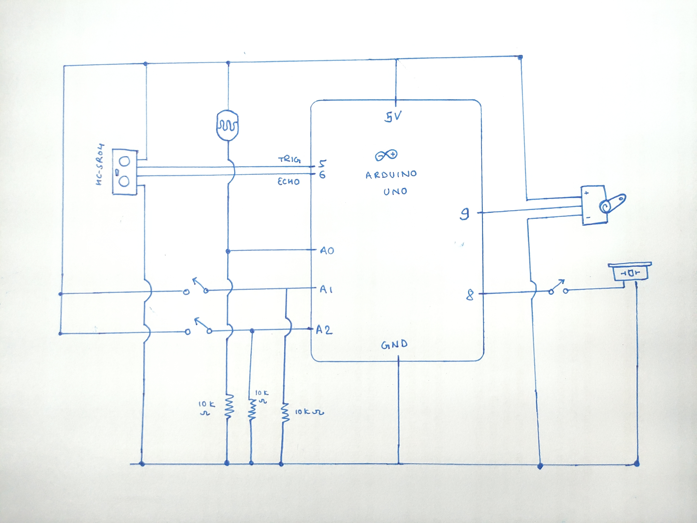

# METRONOME + THEREMIN
This project uses a Servo motor to imitate the behavior of a Metronome and uses Buzzer to play notes with respect to the object distance measured by HC-SR04 sensor.

Here are the notes that will be played:

```c++
#include "pitches.h"

// notes to play when there's bright light
const int lightNotes[] = {NOTE_C4, NOTE_D4, NOTE_E4, NOTE_F4, NOTE_G4, NOTE_A4, NOTE_B4, NOTE_C5};

// notes to play when there's low light
const int darkNotes[] = {NOTE_C3, NOTE_D3, NOTE_E3, NOTE_F3, NOTE_G3, NOTE_A3, NOTE_B3, NOTE_C4};
```
## Schematic



## Result
[See video on YouTube](https://youtu.be/_rU-9QuwsvA)


## Instructions
 * There are two buttons to control the speed of metronome. Red slows it down while Green increases its speed.
 * There's a toggle switch to enable/disable the sound output from buzzer.
 * When there's low light, lower notes (C4, D4, E4, ...) are played. 
 * When there's brighter light, higher notes (C5, D5, E5, ...) are played.

## Challenges
The main challenge was to figure out what kind of instrument to make. Thanks to one of the assigned readings and Sheldon Cooper from "Big Bang Theory," I finally came up with this idea.

Thank you!
