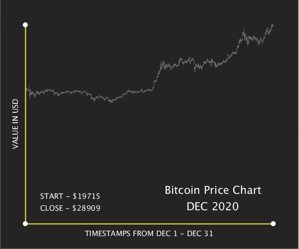

# Data Visualization: Bictcoin Prices from Dec 2020
This is a data visualization project done in Processing to plot a graph of bitcoin price increment from Dec 1, 2020 to Dec 31, 2020.

###  Output


### Data Collection
It would've been a very hard approach to manually search for bitcoin price data going through a ton of webpages from the internet. Therefore, I decided to search for existing dataset that's available on Kaggle.

Here's the link to where I found the data: [Bitcoin Historical Data](https://www.kaggle.com/mczielinski/bitcoin-historical-data)

### Data Cleaning
The data I had downloaded was about 96 MB, meaning that it contained so many data that would take a lot of time to load in Processing. So, I had to find a way to limit these columns on what I needed to plot the graph. As I would only require two fields-timestamp and value of bitcoin-to plot the graph, I used a simple python script to read data and filter only two columns from the data. Here's an example how I performed it:
```python
import pandas as pd
data = pd.read_csv("bitcoin_history.csv")
columns = ["Timestamp", "Weighted_Price"]
data.filter(items=columns).query("Weighted_Price > 0").to_csv("bitcoin.csv", index=False, header=False)
```

### Process
To plot the data in Processing, I loaded ```bitcoin.csv``` file into an array. The array now contained a collection of all lines from the csv file. I also added a margin to the program so that the graph would not cover the whole window.

I then added a loop to go over every line, split the data between timestamp and price value and re-map these values between screen width and height using ```map()``` function in Processing.

Finally, I plotted the data using ```point()``` function. At the end, I also added x and y axes to make it look like a graph.


### Difficulty
Cleaning data from a huge dataset which had numerous unnecessary data was the tricky part. I fortunately worked my way around using ```pandas``` to filter data in Python.

Thank you!