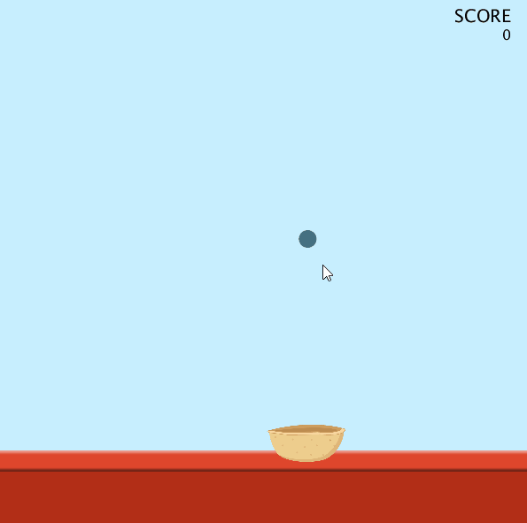

# Game: Catch the Ball
This simple game is an inspiration from the bouncing ball example performed in class. A player has to catch all the balls that start falling from random x-positions at the top.

### Output

### Process
I have created two classes - **Ball and Basket** - to implement the game structure. There are **display()** and **update()** methods that carry out operations required to show elements on screen and update values. When the ball collides with basket, player scores by 10. If the player fails to catch the ball, game is over.

### Graphics
I was able to create the background and basket designs from Adobe Photoshop. The ball is just an ellipse created in Processing.

Thank you!