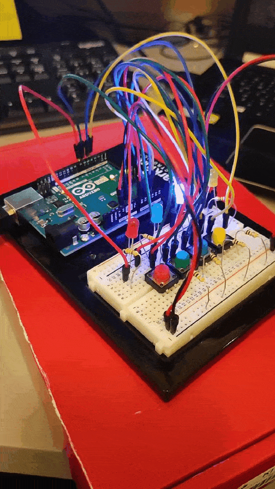

# Bomb Defusal Puzzle
It is a simple puzzle game created using Arduino UNO by using LEDs and Switches. The goal of a player is to remember the random sequence of lights that blink starting from only one color to ten colors (which can be changed as well). If the player is successful in remembering the sequence every time, the bomb defuses, otherwise it blasts.

## Schematic


## Gameplay


## WIN/LOSE
If you mess up the sequence, all lights start blinking at the same time (BOMB BLASTS!).



If you successfully complete the series, lights start blinking one by one in a sequence. (BOMB DEFUSED!)


## Challenges
- Taking note of which steps were performed successfully and finding when the user presses wrong button was quite tricky.
- As there is no way to find the current time in Arduino, setting ```randomSeed()``` as time was not possible. I found on the Arduino Forum that we could set seed to ```analogRead()``` of an empty pin as an alternative.

Thank you!
