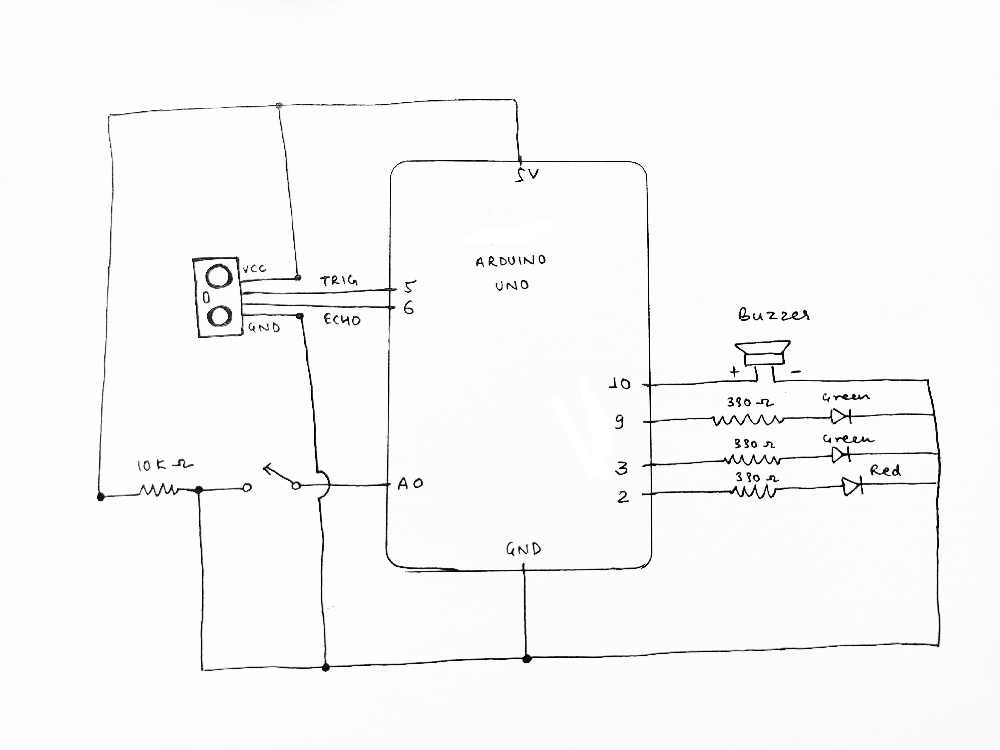

# Collision Detection Simulator
This project uses the Ultrasonic Distance Sensor HC-SR04 to simulate a collision detection system for a vehicle.

There are specifically two modes - Manual and Automatic. In the manual mode, there will be no alert to the user if there are objects in front of it, but a green light will always fade in and out to indicate manual mode. In the Automatic mode, you will be alerted with a red light and a sound of buzzer to stop in case there's an object in less than 10cm distance.

### Schematic

### Output
[Video on YouTube](https://youtu.be/rezcvqOvhxU)

Project Image:

### Challenges
- Buzzer was kind of tricky. When I connected it with a 10k ohm resistor, there was a very low sound. I was able to hear it, but wasn't sufficient for demonstration. So, I removed the resistor to increase current supply and it sounded fine.
- Had to understand how the HC-SR04 module works. Arduino Forum always helps!

Thank you!