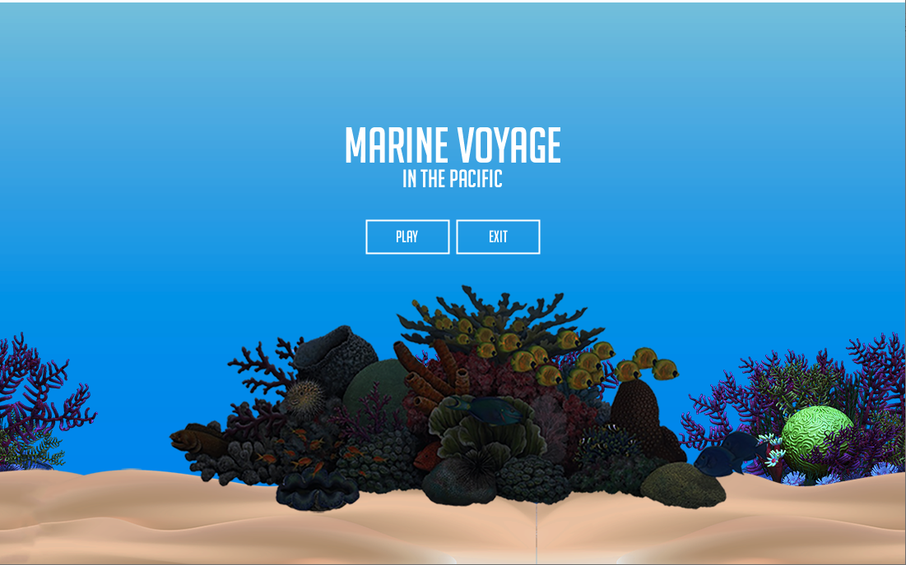
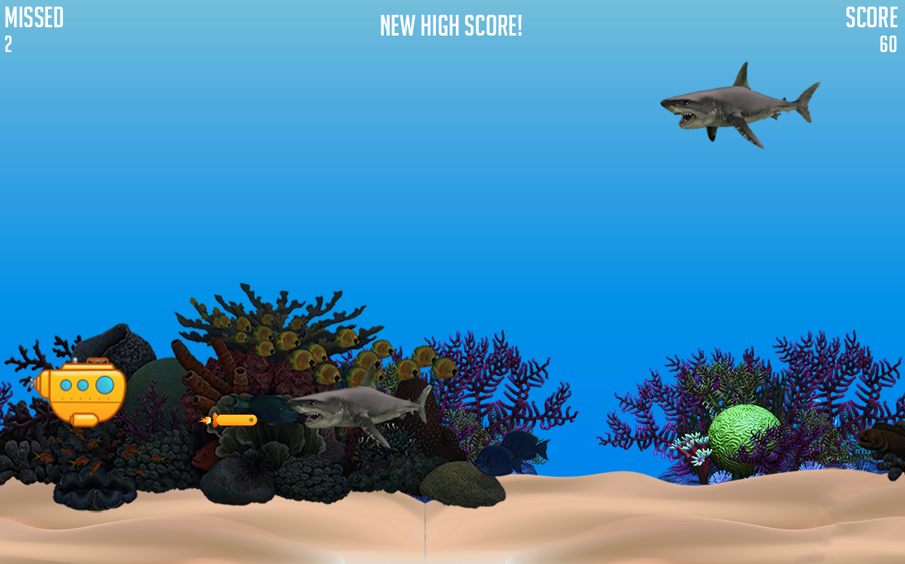
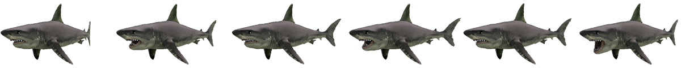
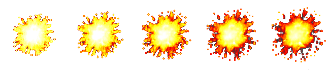

# Marine Voyage in the Pacific
It is a single-player game where your task is to drive underwater in a submarine and try to destroy as many Sharks you can that approach to kill you. Your objective is not to complete tasks and win the game, but your main goal is to win your own high score. You can play as many times as you want and try to beat your best self in the game.

### Gameplay


### Instructions
- Move the Submarine by clicking and dragging the mouse up and down.
- Press SPACEBAR to fire Missiles.
 
### WIN/LOSE
- The game runs infinitely, so your task is to kill as many sharks as you can and beat your own high score.
- If you miss more than more than 5 sharks, you lose.
- If a shark reaches you before you kill it, you lose.

### Development Walkthrough
**MAIN CHARACTER** - SubMarine
A player will be able to move the submarine up and down by clicking and dragging the mouse on the game screen. To do this, I had to use a combination of ```mousePressed()``` event and the movement of the ```SubMarine``` object. But the submarine looked mundane when it was moving. Therefore, I decided to rotate it towards the player's mouse position. Here's how I managed to rotate the submarine using ```arctan2()```, ```translate()```, and ```rotate()``` functions in Processing.

```java
rotation = atan2(mouseY - position.y, mouseX - position.x);
    
if (rotation > radians(30)) { 
  rotation = radians(30);
}
if (rotation < radians(-30)) { 
  rotation = radians(-30);
}
    
pushMatrix();
imageMode(CENTER);
translate(position.x, position.y);
rotate(rotation);
image(img, 0, 0, size, size, cropStart * (img.width / imgCount), 0, cropStart * (img.width / imgCount) + (img.width / imgCount), img.height);
popMatrix();
```

```cropStart``` and ```position``` are updated when the player clicks at certain position on the screen. I also realized that the rotation had to be limited, so I added two quick conditional statements to solve it.

**ENEMY** - Shark
There is only one kind of enemy in the game which is a Shark. The Shark will enter the screen from right at a random y-position and move towards the left, where the player will be moving from. Every ```Shark``` object has a different speed, therefore it is interesting to kind of sort out in the head which Shark to attack first. If the Shark touches the player (SubMarine), game will be over.

**ATTACK** - Missile
A player has to press SPACEBAR in order to fire missile towards the Shark. However, there's a limit in how many missiles a player can fire. If the player continuously presses SPACEBAR at most vertical positions, it will be hard to end the game. So, I have added 4 missiles as the limit. The missile gets fired from player's position and moves to the right (towards the Shark), if it touches the Shark, it'll explode and kill the shark.

**STATES** - Main Menu, Gameplay, Game Over
There are 3 states in the game. The ```Game``` object starts with loading all the images and sound files and shows the main menu. Players will see two buttons to either start playing or ending the game. On pressing PLAY, the game starts and when the player dies or misses more than 5 sharks, game is over.






**HIGH SCORE** - To include the high score mechanism in the game, I simply moved ahead of just creating a variable to store the max score. I have added file read/write functions that reads the ```high-score.txt``` if it exists to get the current high score and writes to the same file if the player beats the current high score.

### Sounds
All background sounds and short effects were downloaded from [Bensound](https://bensound.com) and [Freesound](https://freesound.org). They are both royalty-free sound providers.

### Graphics
I created the SubMarine and the head of the Missile in Adobe Illustrator. The other layers of background images for parallax effect were downloaded from [OpenGameArt](https://opengameart.org) and were tweaked in Photoshop.

Here are all the sprites used:

**SubMarine**


**Missile**


**Shark**



**Explosion**




### Challenges and Learnings
Building a perfect idea of the game was the most challenging part. I had to make it both interesting and efficient. At first, I was trying to incorporate boats and ships but eventually my thought process led me make Submarine as the main player. This trial and experiment process helped me learn about good color combinations and attention to detail. The game looks good right now and I am happy to see what I built over the past weeks.

Thank you!